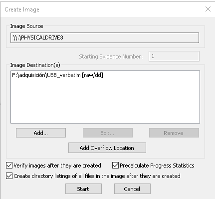

# Actividad 05

# A**dquisición forense de una memoria USB empleando las siguientes herramientas: FTK Imager, GuyImager y dd**

# FTK Imager

Empezamos añadiendo una fuente, en nuestro caso, al ser un USB vamos a seleccionar una unidad física.

Tras esto seleccionamos cual de todas vamos a elegir, en nuestro caso elegimos el USB.

Ahora establecemos las opciones de como se van a hacer la copia, en mi caso utiliza el formato de salida **Raw** y especifico que se hagan comprobaciones tras la creación de la imagen.

Ahora nos pide que rellenemos información sobre la evidencia y el caso que estamos tratando.

Establecemos una ruta para la salida, un nombre para el archivo y la fragmentación de la imagen, en mi caso uso 0 para que se cree en solo una imagen.

La página de creación de imagen queda así y le damos a iniciar.

Inicia la adquisición.

Al terminar la adquisición obtenemos la siguiente pestaña, en la que se nos indica que los hash de la imagen y el original coinciden.

En la ruta de salida obtenemos la imagen y un par de archivos con información sobre la adquisición.

# **GuyImager**

Utilizaremos la herramienta instalada en Kali Linux, la iniciaremos desde la consola con sudo ya que necesita permisos de administrador.

Hacemos click derecho sobre el dispositivo, en este caso **/dev/sda** es nuestro USB. Ahora nos aparecerá la siguiente pestaña para iniciar la adquisición:

Elegimos calcular tanto el **MD5** como el **SHA-1** y la verificación de la imagen. Esta vez hemos elegido otro formato de salida para la imagen y hemos dividido la imagen en grupos de 2047 MiB. Tras esto comienza la adquisición.

Como vemos en la captura anterior, termina correctamente y ahora nos dirigimos a la carpeta de output para confirmar la salida, donde vemos los diferentes bloques y un archivo con información sobre la adquisición.

# dd

Esta herramienta viene instañada por defecto en sistemas Linux, se usa a través de CLI, para realizar la adquisición usaremos el siguiente comando:

Entre las opciones tenemos:

- **if** - Define el dispositivo de input.
- **of** - La ruta donde queremos el output.
- **bs** - Tamaño de los bloques
- **conv** - Esta opción es vital si ejecutamos el comando **dd** en un disco que se sospecha que tiene bloques/sectores "malos" o "defectuosos". Normalmente, la herramienta **dd** finalizará abruptamente el comando si se encuentra un error de lectura en la unidad de origen, lo que evita el parámetro **noerror**.

Tras ingresar el comando se inicia la adquisición.

Al terminar vamos a la ruta y vemos que se ha creado la imagen.

