# A06. Adquisición forense (en vivo) de una máquina windows (memoria volatil y no volatil)

# Introducción

La adquisición forense de una máquina virtual Windows es un proceso crítico en la investigación de incidentes cibernéticos y delitos informáticos. Este procedimiento implica la recopilación de datos tanto de la memoria volátil como de la memoria no volátil de una máquina virtual en tiempo real, con el fin de preservar pruebas digitales cruciales. La adquisición forense en vivo se realiza con el propósito de mantener la integridad de la evidencia, permitiendo a los expertos en seguridad y forenses cibernéticos analizar los datos con el menor impacto posible en la operación del sistema en cuestión.

# ¿Que vamos a adquirir?

Vamos a realizar la adquisición de memora tanto volátil como no volátil, para ello realizaremos diferentes procedimientos y procuraremos asegurar la integridad de las posibles evidencias. Realizamos esta diferenciación de forma que tenemos:

1. Memoria Volátil (RAM): La memoria volátil contiene datos temporales y en tiempo real que están en uso por el sistema operativo y las aplicaciones en ese momento específico. Esta información es esencial en una investigación forense, ya que puede revelar procesos en ejecución, contraseñas en memoria, conexiones de red, y otros datos críticos. La adquisición de la memoria volátil suele hacerse mediante herramientas de software especializadas que toman una imagen de la RAM sin interrumpir la operación del sistema.

2. Memoria No Volátil (Disco Duro): La memoria no volátil se refiere a los datos almacenados en el disco duro u otros dispositivos de almacenamiento de la máquina virtual, como archivos, registros de sistema, configuraciones, y más. La adquisición de la memoria no volátil implica tomar copias bit a bit de los dispositivos de almacenamiento o, en el caso de máquinas virtuales, los archivos de imagen del disco virtual, lo que permite a los forenses analizar la información almacenada en ellos.

Además usaremos herramientas para realizar triaje, triaje se refiere al proceso de priorizar y seleccionar qué datos se adquirirán primero o de manera más urgente durante una investigación forense o una respuesta a incidentes. En otras palabras, se trata de determinar qué partes del sistema se deben adquirir primero o con mayor detalle para minimizar la interrupción y el impacto en las operaciones normales de la máquina o el sistema en cuestión.
# La adquisición

Iniciamos una máquina virtual con Windows 10, que tiene un disco de 42 GB, para segurar la **integridad** de la máquina virtual, crearemos dos USB virtuales en los que van instaladas nuestras herramientas, usamos el software virtualizador virt-manager. Ya que si instalamos las herramientas en la propia máquina, vamos a sobreescribir datos en la memoria volátil, por lo tanto, perdiendo posibles evidencias y alterando gran parte del contenido de la memoria. Además todas las adquisiciones se hacen en los USB, como es obvio, para nos alterar el contenido del disco.

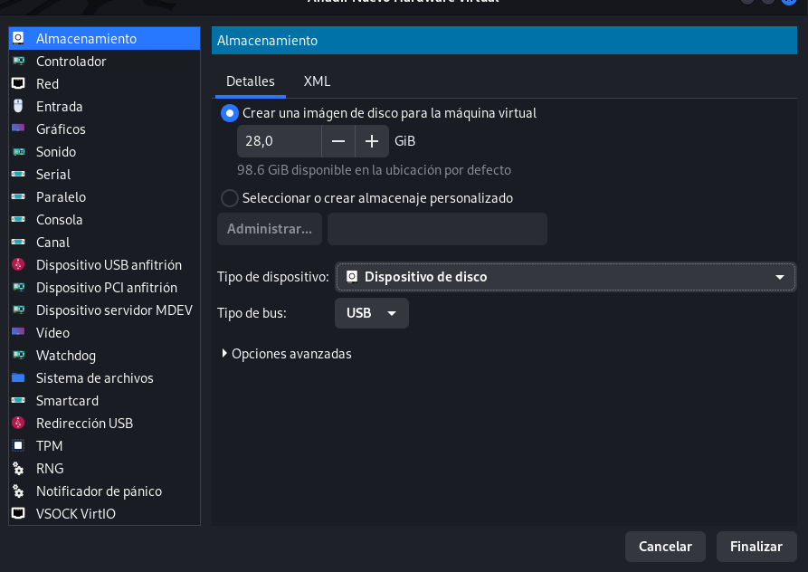

Crearemos dos USB, en uno realizaremos la adquisición de RAM junto al triaje  y en el otro de una capacidad muy superior vamos a realizar la adquisición de disco.

## Herramientas que usaremos
### Memoria volátil y triaje

La primera parte es realizar el triaje y la adquisición de RAM, he seleccionado la herramienta **IRTiage** ya que con ella podemos hacer las dos de forma simultánea, esta herramienta se encuentra dentro de nuestro USB y al ejecutarla veremos lo siguiente:
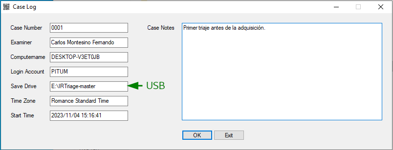
Como vemos, hacemos la adquisición en nuestra unidad USB. Tras rellenar información sobre el caso realizamos el triaije seleccionando la información que queremos adquirir.
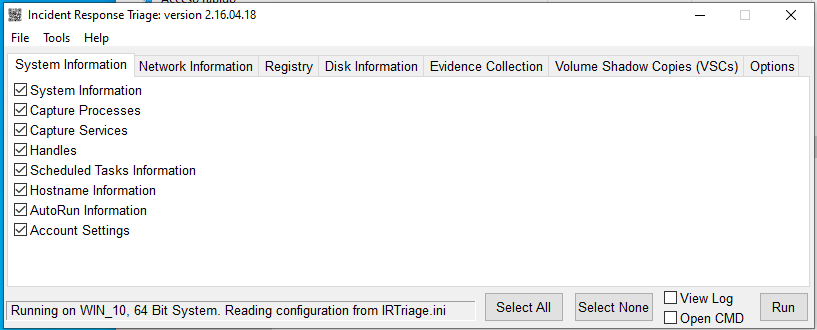
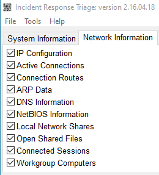 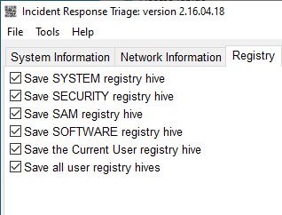

Como vemos podemos seleccionar varias casillas , indicando que información queremos extraer, en mi caso sacaré el máximo posible, lo que incluye una imagen de la memoria RAM.
Al darle al botón "Run" comienza el proceso y al terminar se nos crea en nuestro USB la siguiente estructura de directorios, donde se encuentra la información seleccionada del sistema:
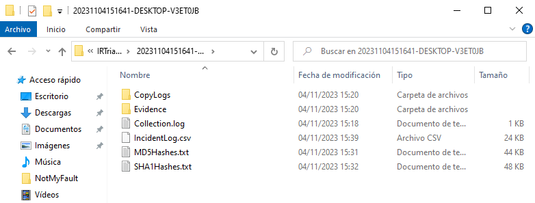
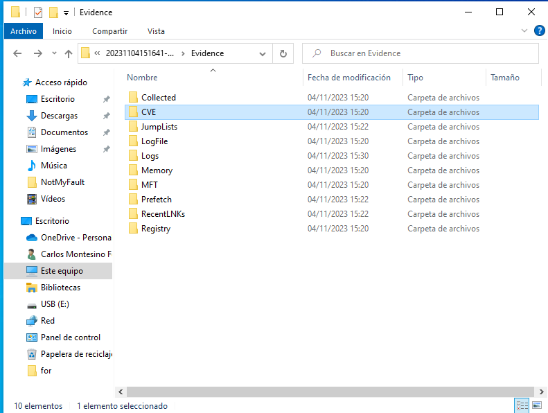
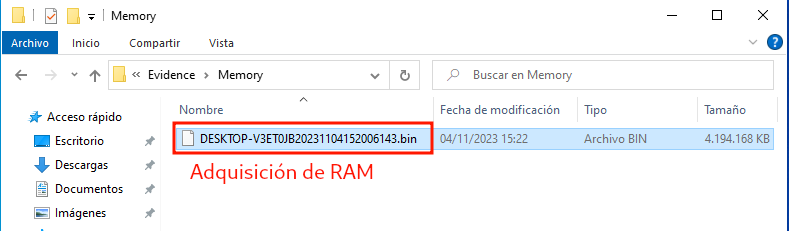
Como vemos tenemos información de CVEs encontrados, nuestra adquisición de memoria en la carpeta "Memory", información de registros, logs y más información del sistema en "Collected" como los usuarios y procesos. Además en la carpeta anterior tenemos todos los hashes de cada archivo extraído.

Otra herramienta que podríamos usar para elegir el formato en el que queremos la captura de la memória RAM es **Ram Capture** que también tenemos instalda en nuestro USB. EL proceso sería el siguiente:
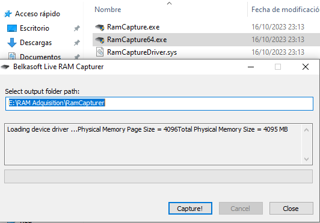

### Memoria no volátil

La herramienta que ussaremos será FTKImager, crearemos uns egundo USB con una capacidad mayor a la del disco del sistema, dentro del USB tendremos isntalado la herramienta.
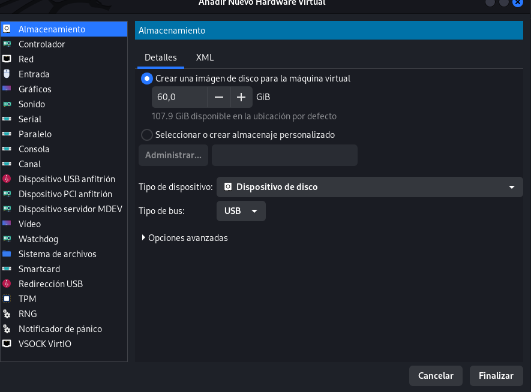
Así se visualizan los dos USB, y el disco de la máquina.
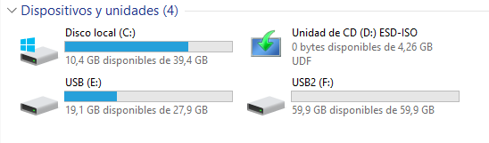

Dentro del segundo USB tenemos:

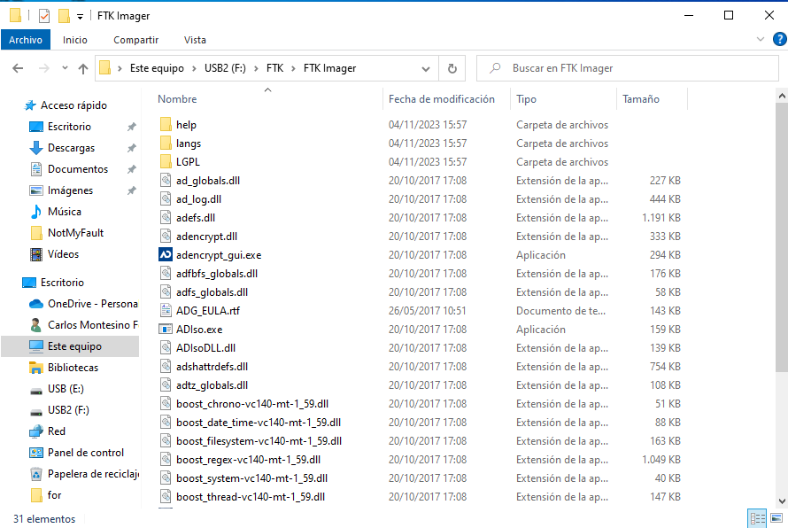

Iniciamos la aplicación y seleccionamos que vamos a hacer la adquisición de nuestro disco principal, rellenamos información del caso, establecemos la ruta de la salida en el propio USB y configuramos las opciones pertinentes, como el tamaño de los bloques y la verificación de la copia.

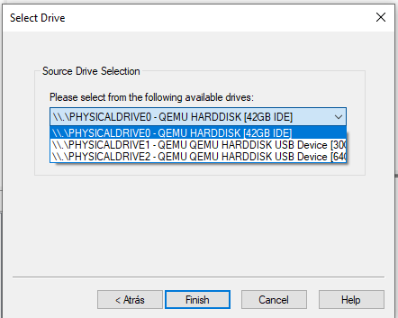

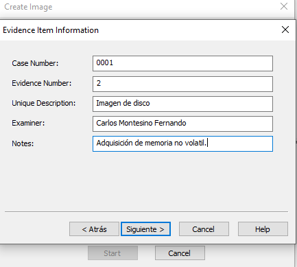
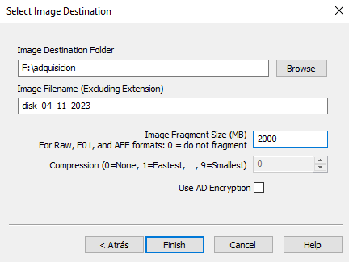
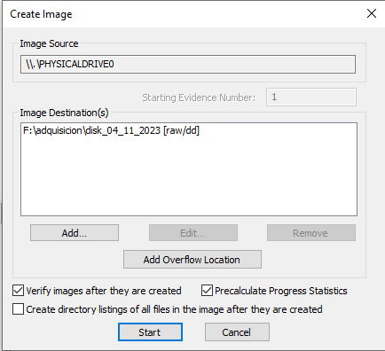
Al terminar todo el proceso observamos que los hash de la copia coinciden, y que en nuestra unidad USB se han creado los diferentes bloques y un archivo txt con información sobre la adquisición.
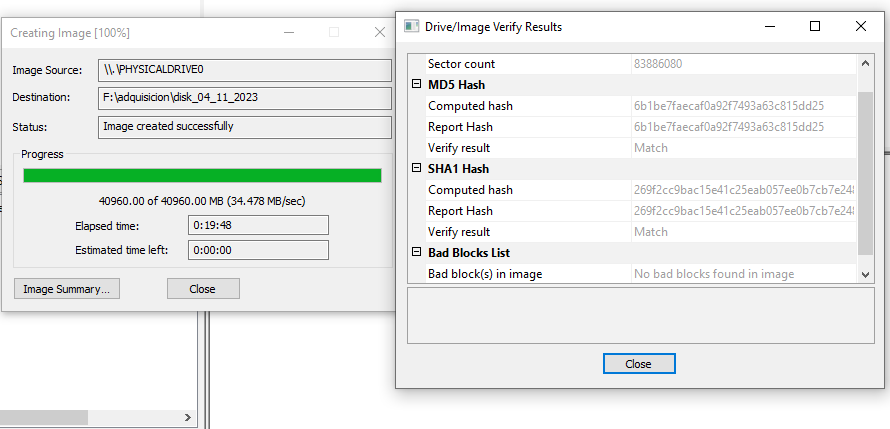
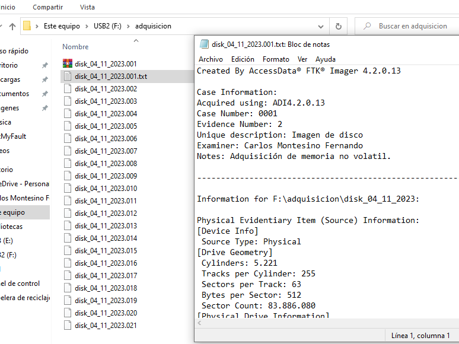