## Parte 1: Recolección y almacenamiento

## Introducción

Este ejercicio forma parte de un proyecto enfocado en la Respuesta a Incidentes Digitales y Forenses (DFIR). 

El ejercicio implica la simulación de un incidente de ciberseguridad, en el cual se ha comprometido una máquina virtual. 

Los objetivos clave incluyen la extracción, decodificación y análisis de evidencias, manteniendo la cadena de custodia; documentar meticulosamente el proceso seguido; realizar un análisis exhaustivo de las evidencias; investigar el incidente de ciberseguridad en sí; y finalmente, elaborar un informe técnico con las conclusiones.

La primera parte del proyecto, consiste en la recolección y almacenamiento de evidencias, siguiendo una metodología establecida y documentando cada paso del proceso. 

Es importante considerar que, aunque el ejercicio es una simulación, se espera que los pasos seguidos sean lo más realistas posible y que se justifique cualquier desviación de la metodología estándar debido a la naturaleza simulada del ejercicio.

[link al drive con evidencias](https://drive.google.com/drive/folders/1dylgi_RGu9Jl0oznpIY-6KZvdH-acdx-?usp=drive_link)
## Contexto

Nos encontramos ante una máquina virtual que utiliza un sistema operativo Windows Vista, tiene 1 GB de RAM y 32 GB de disco. Al llegar nos la encontramos encendida, el software virtualizador es VirtualBox y el sistema anfitrión es un WIndows 11. Al llegar al incidente encontramos lo siguiente:

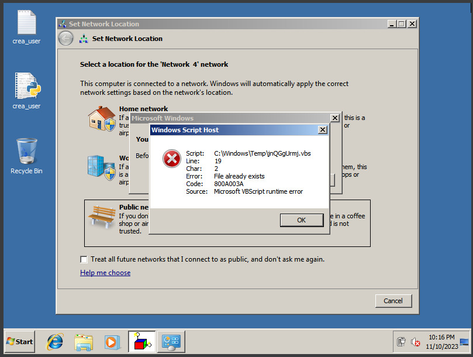

En la siguiente tabla tenemos las características más a fondo:

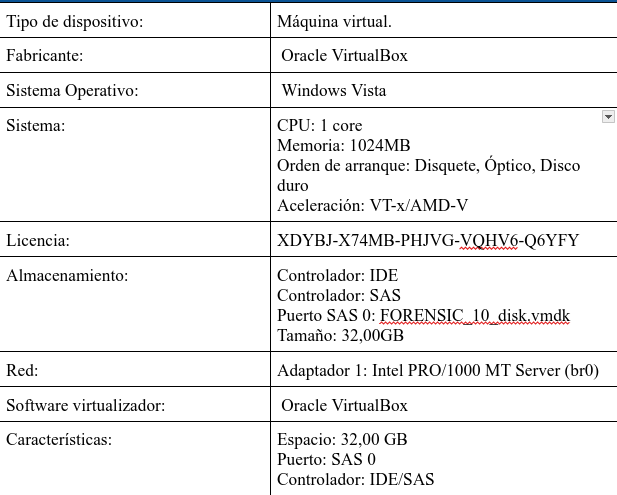
## Cadena de custodia

Para establecer una buena cadena de custodia necesito cumplir los siguiente puntos:

1. **Identificación inicial de la evidencia**: La cadena de custodia comienza con la identificación inicial de la evidencia digital. Esto implica el reconocimiento y registro de la ubicación, el tipo y la naturaleza de los datos relevantes, como archivos, registros del sistema o dispositivos.
2. **Etiquetado y marcado**: La norma ISO/IEC 27037 enfatiza la importancia de etiquetar y marcar la evidencia de manera adecuada. Cada elemento de evidencia debe recibir una etiqueta única que permita su identificación en el futuro. Esto incluye información sobre quién recopiló la evidencia, cuándo se recopiló y la ubicación de origen. Toda esta información se encuentra en los pdf asignados con la tarea.
3. **Preservación y aseguramiento**: La evidencia digital debe preservarse de manera segura para evitar su alteración, eliminación o corrupción. Durante la creación de copias de las evidencias es esencial la presencia de un **NOTARIO** que permita la autenticidad a la hora de presentar la pruebas ante el tribunal en el futuro.
4. **Documentación detallada**: Se creará una documentación exhaustiva del proceso.
5. **Control de accesos**: La cadena de custodia implica un control estricto de quién tiene acceso a la evidencia.
6. **Transporte seguro**: Este punto específico no se cumplirá de forma óptima por necesidades de la práctica, ya que el transporte se realizará por Google Drive.

## Adquisición

Para realizar la adquisición siguiendo nuestra metodología forense (ISO/IEC 27037) he de asegurar que el proceso de adquisición sea:

- Un proceso auditable y evaluable.
- Repetible.
- Reproducible - La reproducibilidad se establece cuando se producen los mismos resultados de prueba en las siguientes condiciones:
    - Utilizando el mismo método de medición.
    - Utilizar diferentes instrumentos y en diferentes condiciones.
    - Puede reproducirse en cualquier momento después de la prueba original.
- Justificable

Nos encontramos ante una evidencia de tipo digital, y el dispositivo está encendido, según la norma ISO/IEC 27037:

> 1 .En primer lugar, considere la adquisición de la evidencia digital potencial que podría perderse si el dispositivo digital se apaga. Esto se conoce como datos volátiles, como los datos almacenados en la RAM, procesos en ejecución, conexiones de red y configuraciones de fecha/hora. En circunstancias en las que sea necesario adquirir datos no volátiles de dispositivos que aún están en funcionamiento, se debe considerar realizar una adquisición en un sistema encendido.
 
> 2 .Realizar una adquisición en tiempo real es necesario para obtener datos en vivo de dispositivos que siguen funcionando. La adquisición en vivo de datos volátiles en la RAM puede permitir la recuperación de información valiosa, como el estado de la red y contraseñas de aplicaciones desencriptadas. La adquisición en tiempo real se puede realizar en la consola del dispositivo o de forma remota a través de la red. Los procesos son diferentes y requieren el uso de diferentes herramientas.
 
> 3 .El DEFR no debe confiar nunca en los programas en los sistemas. Por esta razón, se recomiendan herramientas de confianza obtenidas por el DEFR (binarios estáticos) siempre que sea posible. El DEFR debe ser competente para utilizar herramientas validadas y ser competente para tener en cuenta los efectos que dichas herramientas pueden tener en el sistema (por ejemplo, desplazamiento de la evidencia digital potencial, contenido de la memoria que se traslada cuando se carga software, etc.).

Por lo especificado anteriormente, establecemos un orden de volatilidad, que queda de la siguiente forma:

1. Contenidos de la memoria
2. Estado de las conexiones de red, tablas de rutas
3. Estado de los procesos en ejecución
4. Contenido del sistema de archivos y de los discos duros
5. Contenido de otros dispositivos de almacenamiento

## Preservación

Para protegerse contra la alteración intencionada de la evidencia, se deben abordar los aspectos ambientales con medidas apropiadas. El DEFR debe asegurarse de lo siguiente:

- Utilizar una función de verificación adecuada para demostrar que los archivos copiados son equivalentes a los originales.(HASH)
- Puede ser apropiado asociar al DEFR con la evidencia digital adquirida mediante firmas digitales, biometría y fotografía.
- Utilización de cifrado y contraseñas para proveer acceso.

En este caso el segundo punto será el único que no se lleva  acabo.

## Documentación de la adquisición Caso-0001
### Registros de red | (Evidencia 0004)

Realizaremos la adquisición de información de red de nuestro dispositivo usando la herramienta Incident Response Triage, versión 2.16.04.18, esta herramienta se encuentra en un USB que hemos conectado a la máquina virtual para evitar la instalación de la herrameinta y no alterar el dispositivo, haremos una recolección de todos los registros y archivos que tengan que ver con la red, seindo esto memoria volátil.

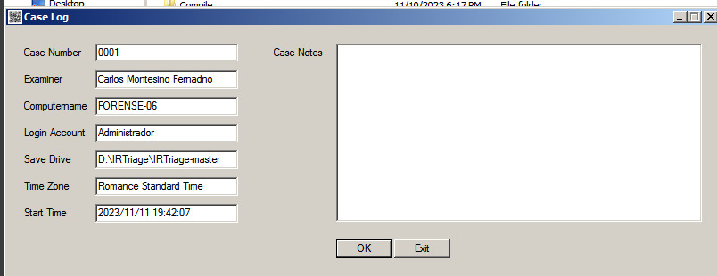

En esta parte solo seleccionaremos la información de red.

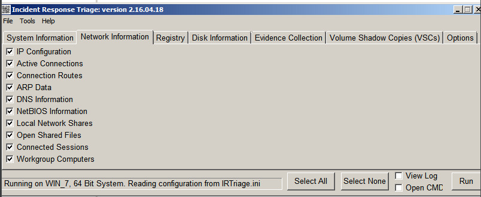

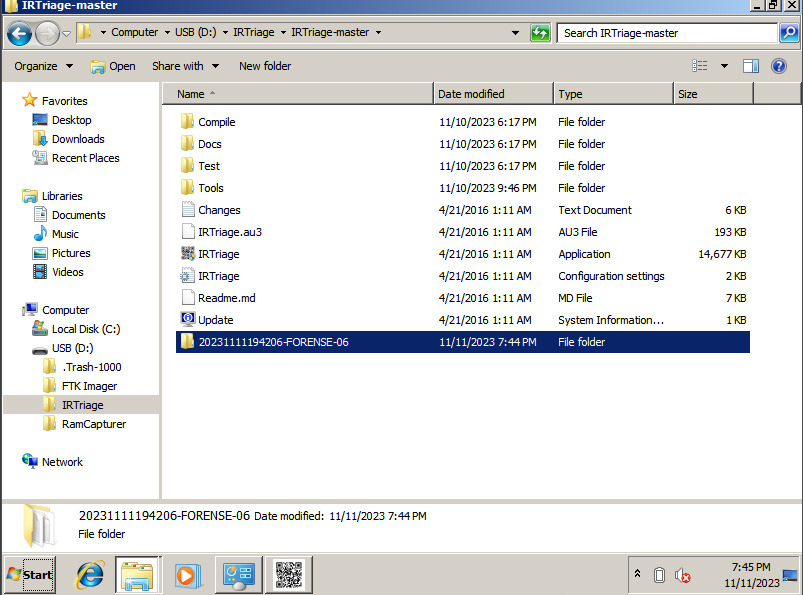

Al terminar la adquisición he obtenido los hash de un fichero zip que contiene las diferentes recolecciones obtenidas.

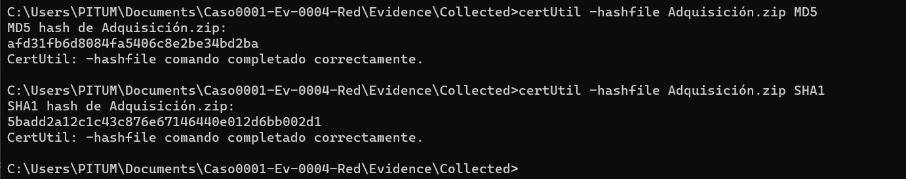

### RAM  | (Evidencia 0002)

A la vez que realizamos la adquisición del sistema de ficheros vamos a realizar una adquisición de la **RAM**, para mantener la integridad del dispositivo, vamos a hacer una adquisición desde una memoria USB conectada al dispositivo anfitrión, que vamos a posteriormente indicar a VirtualBox que sea utilizada por la máquina virtual, de esta forma evitamos hacer la instalación de las herramientas y alterar las pruebas, además la adquisición se creará dentro del propio USB.

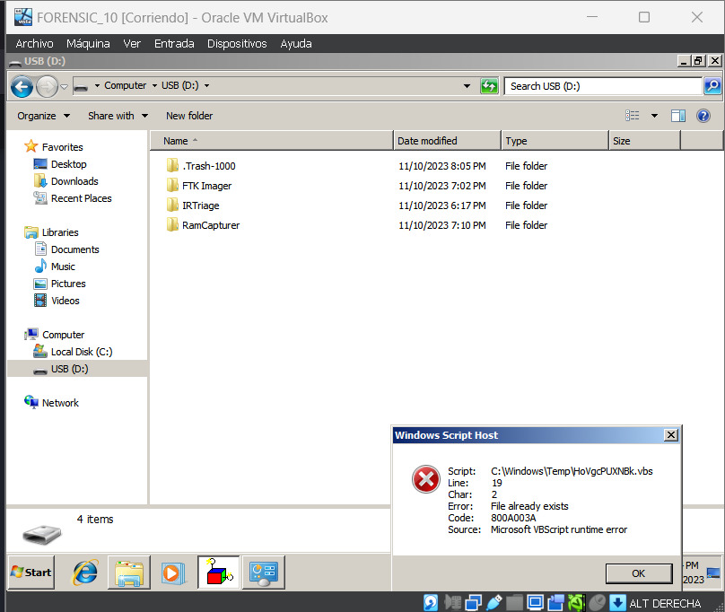

Para la adquisición de la RAM vamos a utilizar Belkasoft Live RAM CapturerVersión: 1.0. Seleccionamos la ruta del output y comenzamos la adquisición.

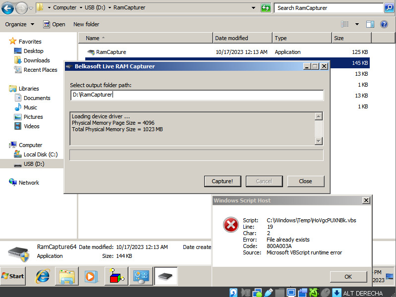

Tras esto he utilizado el siguiente comando para obtener los hash de la memoria capturada, tanto el MD5 como el SHA-1, para añadirlo a los documentos que contienen información para la cadena de custodia.

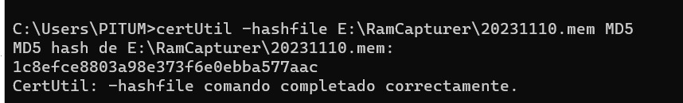

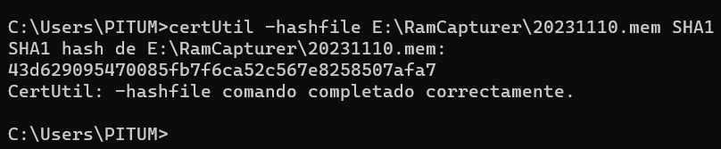

### Clonación de disco virtual | (Evidencia 0001)
Tras la adquisición de la memoria volátil, voy a realizar una de la memoria no volátil, en este caso utilizaremos FTK Imager Versión: 4.2.0.13, realizaremos una adquisición de la imagen del disco, para su posterior almacenamiento y análisis. La herramienta se ejecuta desde el host anfitrión.

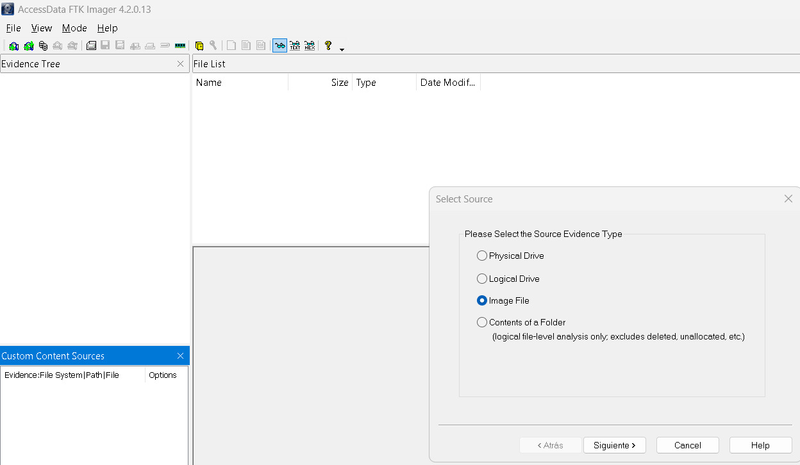

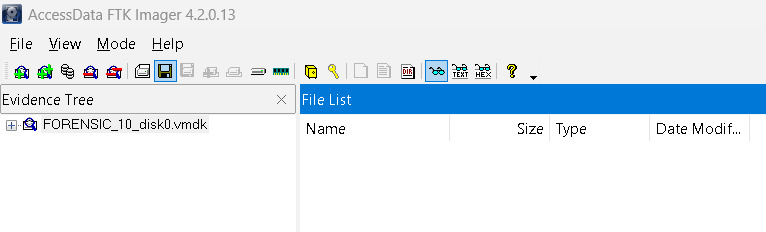 
Selecciono la salida en la carpeta de docuemntos, junto a la adquisición realizada con Autopsy. Además realizo la verificación de la imagen y uso el cifrado AD, el cual protegerá  la evidencia con una frase de paso, en este caso: **For_10_Ensic!**

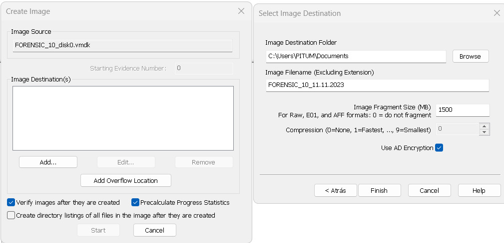

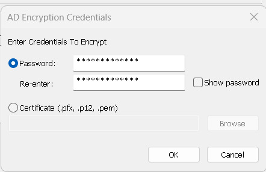

Tras la adquisición completa obtenemos los hash MD5 Y SHA1 verificados.

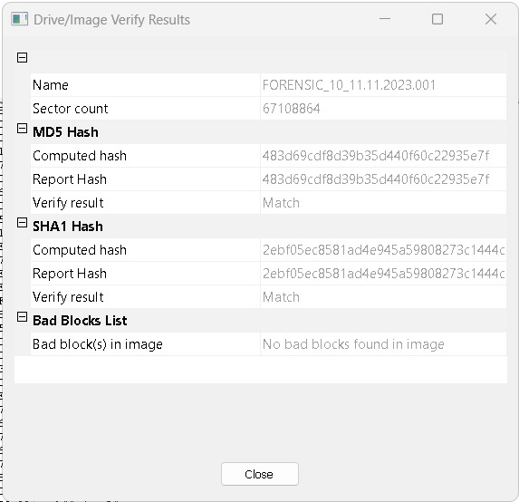

### Almacenamiento y transporte de vestigios

Tras la adquisición de los mismos, quedan almacenados en un sistema seguro, con la realización de copias de los mismos, se apaga la máquina creando un Snapshot de la misma posteriormente. Las evidencias se gurdan ordenadamente con toda la información necesaria y se envían a través de Google Drive para la finalización de esta tarea.

![[33.png]]
